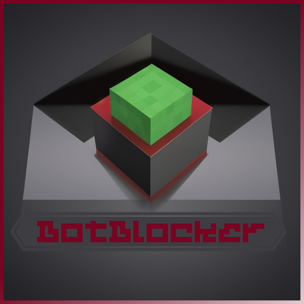

<!-- Improved compatibility of back to top link: See: https://github.com/othneildrew/Best-README-Template/pull/73 -->

[![Contributors][contributors-shield]][contributors-url]
[![Forks][forks-shield]][forks-url]
[![Stargazers][stars-shield]][stars-url]
[![Issues][issues-shield]][issues-url]
[![MIT License][license-shield]][license-url]
[![LinkedIn][linkedin-shield]][linkedin-url]

<!-- PROJECT LOGO -->
 

  

  <h3 align="center">BotBlocker</h3>

  

    A Bukkit/Spigot Minecraft plugin designed to limit bot intrusion!
     
    <a href="https://github.com/AitorAstorga/BotBlocker"><strong>Explore the docs »</strong></a>
     
     
    <a href="https://github.com/AitorAstorga/BotBlocker/issues">Report Bug</a>
    ·
    <a href="https://github.com/AitorAstorga/BotBlocker/issues">Request Feature</a>
  

<!-- TABLE OF CONTENTS -->

  
Table of Contents

  <ol>
    <li>
      <a href="#about-the-project">About The Project</a>
      <ul>
        <li><a href="#built-with">Built With</a></li>
      </ul>
    </li>
    <li>
      <a href="#getting-started">Getting Started</a>
      <ul>
        <li><a href="#prerequisites">Prerequisites</a></li>
        <li><a href="#installation">Installation</a></li>
      </ul>
    </li>
    <li><a href="#usage">Usage</a></li>
    <li><a href="#roadmap">Roadmap</a></li>
    <li><a href="#contributing">Contributing</a></li>
    <li><a href="#license">License</a></li>
    <li><a href="#contact">Contact</a></li>
    <li><a href="#acknowledgments">Acknowledgments</a></li>
  </ol>

<!-- ABOUT THE PROJECT -->
## About The Project

BotBlocker is a plugin for Bukkit/Spigot Minecraft servers designed to limit bot intrusion. It operates by registering the joining and leaving timestamps of players, and if the time difference is less than a minute (by default), access is prohibited. This approach limits the number of login attempts per minute from each UUID, effectively mitigating the consequences of a bot attack.

(<a href="#readme-top">back to top</a>)

### Built With

* 
* [Bukkit/Spigot](https://www.spigotmc.org)

(<a href="#readme-top">back to top</a>)

<!-- GETTING STARTED -->
## Getting Started

To get this plugin up and running on your server, follow these steps:

### Prerequisites

* Java 18 or later
* A Bukkit/Spigot server

### Installation

1. Download the latest BotBlocker `.jar` file from the [releases page](https://github.com/AitorAstorga/BotBlocker/releases).
2. Move the downloaded `.jar` file to the `plugins/` directory in your server.
3. Restart your server. This will generate a default configuration file.

(<a href="#readme-top">back to top</a>)

<!-- USAGE EXAMPLES -->
## Usage

Once installed and enabled, BotBlocker works in the background without any intervention. If needed, you can adjust the bot protection parameters in the generated `config.yml` file.

### Commands
* /BotBlocker enable - Enables the BotBlocker plugin
* /BotBlocker disable - Disables the BotBlocker plugin
* /BotBlocker setTimeLimit [seconds] - Sets the time limit

(<a href="#readme-top">back to top</a>)

<!-- CONTRIBUTING -->
## Contributing

Contributions are what make the open source community such an amazing place to learn, inspire, and create. Any contributions you make are **greatly appreciated**.

If you have a suggestion that would make this better, please fork the repo and create a pull request. You can also simply open an issue with the tag "enhancement".
Don't forget to give the project a star! Thanks again!

1. Fork the Project
2. Create your Feature Branch (`git checkout -b feature/AmazingFeature`)
3. Commit your Changes (`git commit -m 'Add some AmazingFeature'`)
4. Push to the Branch (`git push origin feature/AmazingFeature`)
5. Open a Pull Request

(<a href="#readme-top">back to top</a>)

<!-- LICENSE -->
## License

Distributed under the GNU General Public License v3.0. See `LICENSE` for more information.

(<a href="#readme-top">back to top</a>)

<!-- CONTACT -->
## Contact

Aitor Astorga Saez de Vicuña - a.astorga.sdv@gmail.com

Project Link: [https://github.com/AitorAstorga/BotBlocker](https://github.com/AitorAstorga/BotBlocker)

(<a href="#readme-top">back to top</a>)

<!-- ACKNOWLEDGMENTS -->
## Acknowledgments

Use this space to list resources you find helpful and would like to give credit to. I've included a few of my favorites to kick things off!

* [Choose an Open Source License](https://choosealicense.com)
* [GitHub Emoji Cheat Sheet](https://www.webpagefx.com/tools/emoji-cheat-sheet)
* [Img Shields](https://shields.io)
* [markdown-badges](https://github.com/Ileriayo/markdown-badges#table-of-contents)
* [GitHub Pages](https://pages.github.com)

(<a href="#readme-top">back to top</a>)

<!-- MARKDOWN LINKS & IMAGES -->
<!-- https://www.markdownguide.org/basic-syntax/#reference-style-links -->
[contributors-shield]: https://img.shields.io/github/contributors/AitorAstorga/BotBlocker.svg?style=for-the-badge
[contributors-url]: https://github.com/AitorAstorga/BotBlocker/graphs/contributors
[forks-shield]: https://img.shields.io/github/forks/AitorAstorga/BotBlocker.svg?style=for-the-badge
[forks-url]: https://github.com/AitorAstorga/BotBlocker/network/members
[stars-shield]: https://img.shields.io/github/stars/AitorAstorga/BotBlocker.svg?style=for-the-badge
[stars-url]: https://github.com/AitorAstorga/BotBlocker/stargazers
[issues-shield]: https://img.shields.io/github/issues/AitorAstorga/BotBlocker.svg?style=for-the-badge
[issues-url]: https://github.com/AitorAstorga/BotBlocker/issues
[license-shield]: https://img.shields.io/github/license/AitorAstorga/BotBlocker.svg?style=for-the-badge
[license-url]: https://github.com/AitorAstorga/BotBlocker/blob/master/LICENSE
[linkedin-shield]: https://img.shields.io/badge/-LinkedIn-black.svg?style=for-the-badge&logo=linkedin&colorB=555
[linkedin-url]: https://linkedin.com/in/aitor-astorga-saez-de-vicuña
[product-screenshot]: images/screenshot.png

[Next.js]: https://img.shields.io/badge/next.js-000000?style=for-the-badge&logo=nextdotjs&logoColor=white
[Next-url]: https://nextjs.org/
[React.js]: https://img.shields.io/badge/React-20232A?style=for-the-badge&logo=react&logoColor=61DAFB
[React-url]: https://reactjs.org/
[Vue.js]: https://img.shields.io/badge/Vue.js-35495E?style=for-the-badge&logo=vuedotjs&logoColor=4FC08D
[Vue-url]: https://vuejs.org/
[Angular.io]: https://img.shields.io/badge/Angular-DD0031?style=for-the-badge&logo=angular&logoColor=white
[Angular-url]: https://angular.io/
[Svelte.dev]: https://img.shields.io/badge/Svelte-4A4A55?style=for-the-badge&logo=svelte&logoColor=FF3E00
[Svelte-url]: https://svelte.dev/
[Laravel.com]: https://img.shields.io/badge/Laravel-FF2D20?style=for-the-badge&logo=laravel&logoColor=white
[Laravel-url]: https://laravel.com
[Bootstrap.com]: https://img.shields.io/badge/Bootstrap-563D7C?style=for-the-badge&logo=bootstrap&logoColor=white
[Bootstrap-url]: https://getbootstrap.com
[JQuery.com]: https://img.shields.io/badge/jQuery-0769AD?style=for-the-badge&logo=jquery&logoColor=white
[JQuery-url]: https://jquery.com 
